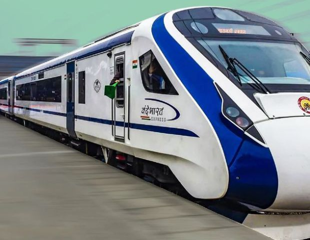
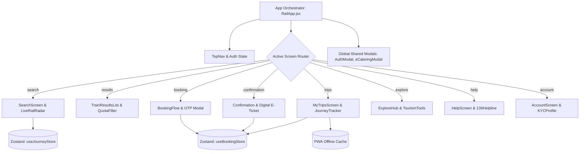

<div align="center">

# 🚆 RailYatra — Next-Gen IRCTC Indian Railways Redesign

<p align="center">
  <b>An ambitious, human-centered UI/UX transformation of the Indian Railways passenger experience.</b>
  <br/>
  <i>Engineered for speed, clarity, transparency, zero dead-ends, and visual delight.</i>
</p>

<p align="center">
  <a href="https://Mokshagnatej.github.io/RailYatra-Next-Gen-IRCTC-Indian-Railways-Redesign/">
    
  </a>
</p>

<!-- Quick Navigation Pills -->
<p align="center">
  <a href="#-the-evolution-of-indian-railways"><b>Evolution</b></a> •
  <a href="#-the-vision--transformation"><b>The Vision</b></a> •
  <a href="#-key-features--modules"><b>Features</b></a> •
  <a href="#%EF%B8%8F-technology-stack--architectural-rationale"><b>Tech Stack</b></a> •
  <a href="#-application-architecture"><b>Architecture</b></a> •
  <a href="#-design-system--tokens"><b>Design System</b></a> •
  <a href="#-getting-started--deployment"><b>Quickstart</b></a>
</p>

<p align="center">
  
  
  
  
  
  
  
</p>

</div>

---

## 🚂 The Evolution of Indian Railways

> *"From the iconic thunder of diesel workhorses across non-electrified frontiers to the aerodynamic, silent acceleration of indigenous semi-high-speed trainsets — RailYatra is designed to mirror the engineering leap of Indian Railways."*

<table width="100%">
  <thead>
    <tr>
      <th width="33%" align="center">
        <br/>
        <b>WDP-4D Diesel Power</b>
      </th>
      <th width="33%" align="center">
        <br/>
        <b>High-Capacity Double Decker</b>
      </th>
      <th width="33%" align="center">
        <br/>
        <b>Semi-High Speed Vande Bharat</b>
      </th>
    </tr>
  </thead>
  <tbody>
    <tr>
      <td align="center" valign="top">
        
        <br/><br/>
        <b>Classic Diesel Traction (4500 HP)</b>
        <p align="left">
          <sub>• <b>Role:</b> Long-distance heavy express & mail trains.<br/>
          • <b>Significance:</b> The rugged dual-cab backbone of Indian transit across non-electrified routes for decades.<br/>
          • <b>Top Speed:</b> 130–135 km/h.</sub>
        </p>
      </td>
      <td align="center" valign="top">
        
        <br/><br/>
        <b>Bi-Level Commuter Express</b>
        <p align="left">
          <sub>• <b>Role:</b> High-density passenger transit between major economic hubs.<br/>
          • <b>Significance:</b> Maximized seat allocation per rake with distinctive yellow-orange aerodynamic coaches.<br/>
          • <b>Top Speed:</b> 110–120 km/h.</sub>
        </p>
      </td>
      <td align="center" valign="top">
        
        <br/><br/>
        <b>Train 18 (EMU Trainset)</b>
        <p align="left">
          <sub>• <b>Role:</b> Next-generation intercity rapid express.<br/>
          • <b>Significance:</b> Indigenous self-propelled EMU, Kavach anti-collision safety, regenerative braking & luxury comfort.<br/>
          • <b>Top Speed:</b> 160–180 km/h.</sub>
        </p>
      </td>
    </tr>
  </tbody>
</table>

---

## 🌟 The Vision & Transformation

Every day, over **24 million passengers** rely on Indian Railways. However, legacy booking platforms often introduce stress during high-stakes booking windows (such as Tatkal), ambiguous waitlist probabilities, and fragmented post-booking tools.

**RailYatra reimagines this entire touchpoint with a modern, friction-free experience:**

| Dimension | Legacy IRCTC Portal | RailYatra Next-Gen Redesign |
| :--- | :--- | :--- |
| **Visual Architecture** | Dense tables, banner ad clutter, sensory overload | Editorial typography, warm heritage palette, glassmorphism |
| **Tatkal Booking** | High anxiety, session timeouts, unclear timer | Live real-time Tatkal pulse countdown & instant quota tags |
| **Payment Flow** | Ambiguous debit states, silent failures | Zero dead-end checkout with interactive OTP confirmation |
| **Live Telemetry** | Delayed third-party status lookups | Real-time GPS-assisted rail radar with live speed & platform info |
| **In-Transit Catering** | Separate portal login required | Integrated seat-delivery eCatering modal for upcoming stations |
| **Theme & Accessibility** | Single fixed light theme with harsh glare | Automatic system-synced Dark Mode with customized CSS tokens |
| **Offline Connectivity** | Inaccessible during tunnel signal drops | PWA Service Worker caching for instant offline e-ticket retrieval |

---

## 🚀 Key Features & Modules

### 1. 🔍 Intelligent Train Search & Booking Flow
- **GPS-Assisted Station Matcher**: Automatically calculates proximity to major junctions (NDLS, BCT, HWH, SBC, MAS, etc.).
- **Tatkal Pulse & Countdown**: Real-time ticker counting down to AC (10:00 AM) and Non-AC (11:00 AM) Tatkal booking windows.
- **Transparent Multi-Tier Fares**: Live dynamic fare matrix comparing 1A, 2A, 3A, 3E, and Sleeper with confirmation probability indicators.
- **Berth Matrix & Add-ons**: Built-in seat preference selector (Lower, Upper, Side Lower), auto-upgrade opt-ins, and travel insurance.

### 2. 📡 Live Rail Radar & Dynamic Train Telemetry
- **Live Rail Radar**: Real-time simulated train tracking displaying cruising speed (up to 130 km/h), upcoming station halts, and on-time status.
- **Station Platform Telemetry**: Instant platform indicators and ETA countdowns for seamless station reception.

### 3. 🍱 In-Transit eCatering Integration
- **Food Delivery to Seat**: Integrated restaurant discovery for upcoming halts (e.g., Domino’s, Haldiram’s, Comesum).
- **Scheduled Station Delivery**: Order hot meals timed directly with your train arrival schedule without leaving your seat.

### 4. 💳 Frictionless Payment & OTP Gateway
- **Multi-Method Gateway**: Supports UPI (GPay, PhonePe), Net Banking, Credit/Debit Cards, and IRCTC eWallet.
- **Simulated OTP Verification**: Interactive 6-digit OTP verification powered by `input-otp` with immediate transaction feedback and simulated recovery states.

### 5. 🎫 My Trips Command Center & Offline Digital E-Tickets
- **Dynamic Digital E-Ticket**: Instant boarding pass with coach allocation, seat numbers, passenger directory, and scannable QR verification for TTEs.
- **Live Route Progression**: Halt-by-halt journey visualizer showing completed, current, and upcoming stations.
- **Automated TDR & Refund Tracker**: Step-by-step progress timeline for cancellations and automated refund tracking.

### 6. 🧭 IRCTC Tourism & Discovery Hub
- **Trains Between Stations Tool**: Quick schedule, halt, and train frequency lookup.
- **Fare Breakdown Calculator**: Itemized fare transparency (Base Fare, Superfast Charges, GST, and Convenience Fees).
- **Retiring Rooms Reservation**: Book luxury retiring suites, executive lounges, and dormitory pods across 900+ junctions.
- **Curated Tourism Circuits**: Featured luxury itineraries (Bharat Gaurav, Maharajas' Express, Golden Chariot).

---

## 🛠️ Technology Stack & Architectural Rationale

```
                    ┌─────────────────────────────────────────────────┐
                    │               RailYatra Next-Gen                │
                    │         React 19 + TypeScript + Vite 8          │
                    └────────────────────────┬────────────────────────┘
                                             │
             ┌───────────────────────────────┼───────────────────────────────┐
             │                               │                               │
             ▼                               ▼                               ▼
   ┌───────────────────┐           ┌───────────────────┐           ┌───────────────────┐
   │    Global State   │           │    UI & Motion    │           │   PWA & Service   │
   │      (Zustand)    │           │  (Tailwind v4)    │           │      Worker       │
   ├───────────────────┤           ├───────────────────┤           ├───────────────────┤
   │ • useBookingStore │           │ • Dynamic Tokens  │           │ • Offline Ticket  │
   │ • useJourneyStore │           │ • Glassmorphism   │           │ • Asset Caching   │
   │ • useAuthStore    │           │ • Dark Mode Query │           │ • Workbox Engine  │
   └───────────────────┘           └───────────────────┘           └───────────────────┘
```

### ⚛️ Frontend Framework & Core
- **React 19**: Utilizing the latest component primitives for modular, high-performance rendering.
- **TypeScript 5.7**: End-to-end type safety across booking payloads, station timetables, and passenger state.

### 📦 Global State Management (Zustand)
- **`useBookingStore`**: Manages active search criteria, passenger lists, berth preferences, and confirmed booking records with local persistence.
- **`useJourneyStore`**: Drives live rail telemetry, simulated WebSocket train progression, speed calculations, and platform updates.
- **`useAuthStore`**: Manages user authentication, profile details, and saved passenger directories.

### 🎨 Styling, Design Tokens & 3D Aesthetics
- **Tailwind CSS v4 & CSS Variables**: Theme-aware color variables (`--blue`, `--marigold`, `--paper`, `--surface`, `--ink`).
- **Native System Dark Mode**: Seamlessly switches between light and dark palettes using `@media (prefers-color-scheme: dark)`.
- **Lucide Icons**: Semantic iconography for railway wayfinding, berths, and alerts.
- **Glassmorphism & Depth**: Multi-layered backdrop blurs and floating modal dialogs creating a modern 3D UI feel.

### 📱 Progressive Web App (PWA)
- **Vite PWA Plugin (`vite-plugin-pwa` / Workbox)**: Caches app assets and travel records using a `CacheFirst` strategy, ensuring uninterrupted e-ticket access during tunnel transit or weak signal areas.

### ⚡ Build Tooling & Deployment
- **Vite 8**: Sub-second Hot Module Replacement (HMR) and optimized rollup production bundles.
- **gh-pages**: Automated zero-configuration deployment to GitHub Pages.

---

## 📐 Application Architecture & Screen Flow



---

## 🎨 Design System & Color Tokens

The color palette pays homage to Indian Railways' heritage while maintaining an editorial digital aesthetic:

| Swatch | Token Name | CSS Variable | Hex Code | Semantic Role |
| :---: | :--- | :--- | :--- | :--- |
|  | **Deep Rail Blue** | `--blue` | `#0F2A45` | Primary brand surfaces, top navigation, headers |
|  | **Marigold Yellow** | `--marigold` | `#E5A93D` | Call-to-action buttons, active badges, highlights |
|  | **Heritage Paper** | `--paper` | `#F7F4EC` | Warm textured canvas background (Light Mode) |
|  | **Midnight Surface**| `--surface` | `#FFFFFF` / `#162436` | High-contrast card surfaces with dark mode support |
|  | **Signal Green** | `--green` | `#1F7A4C` | Confirmed berths, on-time alerts, verified KYC |
|  | **Alert Red** | `--red` | `#C23B32` | Cancellations, Tatkal urgency, refund alerts |

---

## 💻 Getting Started & Deployment

### 1. Clone & Setup Repository
```bash
# Clone the project
git clone https://github.com/Mokshagnatej/RailYatra-Next-Gen-IRCTC-Indian-Railways-Redesign.git

# Navigate into the project directory
cd RailYatra-Next-Gen-IRCTC-Indian-Railways-Redesign

# Install dependencies
npm install
```

### 2. Run Locally in Development Mode
```bash
npm run dev
```
> Open [http://localhost:5173/](http://localhost:5173/) to explore RailYatra locally with hot-reloading.

### 3. Build for Production
```bash
npm run build
```

### 4. Auto-Deploy Live to GitHub Pages
```bash
npm run deploy
```
> Automatically compiles the production bundle and pushes directly to the `gh-pages` branch for instant live updates.

---

## 👥 Credits & Disclaimer

- **Design & Engineering**: Crafted with care for the Indian Railways commuter community.
- **Disclaimer**: *This project is an independent concept redesign and portfolio demonstration. It is not officially affiliated with or endorsed by Indian Railways, IRCTC Ltd., or the Ministry of Railways.*

<br/>

<div align="center">
  <b>🚆 RailYatra — Redefining Indian Rail Transit for Millions.</b>
  <br/>
  <sub>Made with ❤️ for Indian Railways travelers across the nation.</sub>
</div>
