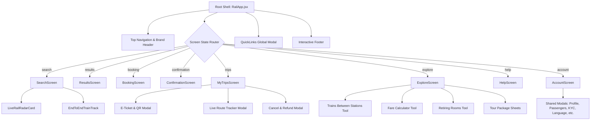

<div align="center">

# 🚆 RailYatra — Next-Gen IRCTC Indian Railways Redesign

### *Book Indian train tickets without the guesswork.*

An ambitious, human-centered UI/UX transformation of the Indian Railways Catering & Tourism Corporation (IRCTC) portal. Engineered for speed, clarity, transparency, and delight.

[](https://react.dev/)
[](https://www.typescriptlang.org/)
[](https://vitejs.dev/)
[](https://tanstack.com/)
[](https://lucide.dev/)

[Features](#-key-features--modules) • [Live Demo](#-live-demo--preview) • [Design System](#-design-system--tokens) • [Architecture](#-architecture--directory-structure) • [Getting Started](#-getting-started) • [Tech Stack](#-technology-stack)

**Live Site:** [https://Mokshagnatej.github.io/UI-UX-Design-Event/](https://Mokshagnatej.github.io/UI-UX-Design-Event/)

</div>

---

## 🌟 The Vision & Problem Statement

Millions of passengers book train tickets across India every day. However, traditional booking portals suffer from:
1. **High cognitive friction during Tatkal windows**: Rushed bookings, mysterious waitlist movement, and unclear quota rules.
2. **Stressful payment dead-ends**: Money debited without ticket confirmation or transparent refund SLAs.
3. **Fragmented post-booking experience**: PNR status, coach charts, e-tickets, and cancellation/TDR tools scattered across disconnected sub-pages.
4. **Outdated visual aesthetics**: Cluttered banner ads, dense tables, and lack of mobile-responsive touchpoints.

**RailYatra solves this** with an ultra-clean, intuitive, single-page reactive architecture featuring honest seat availability indicators, animated real-time rail radar, instant modal tools, and a frictionless booking engine.

---

## 🌐 Live Demo & Preview

- **GitHub Pages:** [https://Mokshagnatej.github.io/UI-UX-Design-Event/](https://Mokshagnatej.github.io/UI-UX-Design-Event/)

---

## 🚀 Key Features & Modules

### 1. 🔍 Smart Train Search & Booking Flow
- **GPS-Assisted Nearest Station Finder**: Automatically calculates distance and selects nearest rail hubs (NDLS, BCT, HWH, SBC, MAS, etc.).
- **Tatkal Pulse & Countdown**: Real-time timer indicating upcoming Tatkal booking windows with quota availability.
- **Transparent Multi-Tier Fares**: Dynamic fare calculator comparing 1A, 2A, 3A, 3E, and Sleeper classes with live confirmation probability tags.
- **Zero Dead-End Checkout**: Interactive booking workflow with saved passenger selector, berth preference matrix, and real-time payment validation.

### 2. 📡 Live Rail Radar & Dynamic Train Animation
- **`LiveRailRadarCard`**: Live radar displaying current train coordinates, cruising speed (up to 130 km/h), upcoming station halts, and on-time status.
- **`EndToEndTrainTrack`**: Full-width panoramic animated train running across scenic Indian landscapes with realistic physics, dusk/night transitions, and smoke effects.

### 3. 🎫 My Trips & Journey Command Center
- **Dynamic Digital E-Ticket**: Includes passenger details, coach/seat allocation, and QR code for instant TTE verification.
- **Live PNR Enquiry**: One-click status checker displaying charting status, RAC movement, and berth numbers.
- **Interactive Live Train Tracking**: Halt-by-halt journey visualizer with completed, active, and upcoming stations.
- **TDR & Refund Tracker**: Step-by-step progress timeline for cancellations and automated bank refunds.

### 4. 🧭 IRCTC Tourism & Discovery (Explore Hub)
- **3 Interactive Railway Tools**:
  - *Trains Between Stations*: Timetables, halts, and train frequencies.
  - *Fare Enquiry Calculator*: Complete transparent fare breakdown (Base fare, GST, Tatkal surcharge, Superfast fees).
  - *Station Retiring Rooms*: Reserve AC Deluxe rooms, executive suites, and dormitory pods across 900+ junctions.
- **Infinite Carousel of Trending Circuits**: Auto-scrolling destination cards (Kashmir, Kerala, Rajasthan, North East) with pause-on-hover.
- **Curated Tourism Packages**: Bharat Gaurav, Maharajas' Express, and spiritual yatra itineraries with modal booking sheets.

### 5. 🆘 24×7 Passenger Support & Helpline
- One-touch emergency dialer for **Railway Helpline 139**.
- Direct grievance tracking by reference ID and direct email portal.
- Expandable interactive FAQ accordions covering Tatkal rules, cancellation fees, e-Catering, and boarding point policies.

### 6. 👤 Passenger Profile & Settings
- **Master Passenger Directory**: Add and manage family members with berth preferences.
- **Saved Payment Methods**: Manage UPI IDs and credit/debit cards.
- **KYC & Aadhaar Status**: Verified passenger authentication indicator.
- **Multi-Language Switcher**: Instant switching between English, Hindi, Telugu, Tamil, Bengali, and Marathi.
- **Notification Toggles**: Granular SMS, WhatsApp, and push alert triggers.

---

## 📐 Architecture & Flow



---

## 🎨 Design System & Tokens

The design system honors Indian Railways' heritage while adopting a modern editorial aesthetic:

| Token | CSS Variable | Hex / Value | Purpose |
| :--- | :--- | :--- | :--- |
| **Deep Rail Blue** | `--blue` | `#0F2A45` | Primary navigation, brand surfaces, active buttons |
| **Navy Accent** | `--blue-2` | `#1B4470` | Secondary headers, hover states, gradients |
| **Midnight Navy** | `--blue-3` | `#091C31` | Deep backgrounds, top banner bar |
| **Marigold Yellow** | `--marigold` | `#E5A93D` | Call-to-actions, badges, brand accents |
| **Amber Gold** | `--marigold-2` | `#C08321` | Highlights, stars, notifications |
| **Heritage Paper** | `--paper` | `#F7F4EC` | Soft textured warm canvas background |
| **Warm Card** | `--paper-2` | `#EFEADC` | Card backgrounds, icon containers |
| **Forest Green** | `--green` | `#1F7A4C` | Confirmed seats, on-time alerts, verified KYC |
| **Signal Red** | `--red` | `#C23B32` | Cancellations, errors, Tatkal warnings |
| **Steel Gray** | `--steel` | `#6D7681` | Subtitles, helper text, borders |

### Typography
- **Headings & Display**: `Space Grotesk` (Geometric, contemporary)
- **Body & UI**: `IBM Plex Sans` (Legible, functional, engineered)
- **Data & Numbers**: `IBM Plex Mono` (PNR numbers, train IDs, seat allocations)

---

## 📂 Directory Structure

```text
UI-UX-Design-Event/
├── public/                     # Static assets & icons
├── src/
│   ├── components/
│   │   ├── common/             # Reusable UI primitives
│   │   │   ├── FadeIn.jsx      # Motion & entry animations
│   │   │   ├── PageHero.jsx    # Standardized section hero banner
│   │   │   └── Shared.jsx      # Centralized modal dialogs & ToolCards
│   │   ├── features/
│   │   │   ├── animation/      # Panoramic train track animation
│   │   │   │   └── EndToEndTrainTrack.jsx
│   │   │   └── radar/          # Live radar & GPS train tracker
│   │   │       └── LiveRailRadarCard.jsx
│   │   ├── layout/             # Header, Navigation & Footers
│   │   ├── ui/                 # Accessible primitives
│   │   ├── ConfirmationScreen.jsx # Booking success & digital receipt
│   │   ├── HomeSections.jsx    # Feature showcase & promo sections
│   │   ├── Illustrations.jsx   # SVG decorative components
│   │   └── RailApp.jsx         # Main application orchestrator & shell
│   ├── routes/                 # TanStack Start file-based routing
│   │   ├── __root.tsx          # Root HTML layout & providers
│   │   └── index.tsx           # Home entrypoint route
│   ├── screens/                # Top-level application screens
│   │   ├── AccountScreen.jsx   # Profile, KYC, settings & preferences
│   │   ├── ExploreScreen.jsx   # Interactive tourism & planning tools
│   │   ├── HelpScreen.jsx      # Support, helpline & FAQ accordions
│   │   └── MyTripsScreen.jsx   # PNR status, journey tracking & refunds
│   ├── styles.css              # Global styles, keyframes & design tokens
│   └── routeTree.gen.ts        # TanStack Router auto-generated tree
├── package.json
├── tsconfig.json
└── vite.config.ts
```

---

## 💻 Getting Started

### Prerequisites
- **Node.js**: v18.0.0 or higher
- **npm** or **bun** / **pnpm**

### Installation

1. **Clone the repository**:
   ```bash
   git clone https://github.com/your-username/UI-UX-Design-Event.git
   cd UI-UX-Design-Event
   ```

2. **Install dependencies**:
   ```bash
   npm install
   ```

3. **Start the local development server**:
   ```bash
   npm run dev
   ```
   The application will be live at `http://localhost:5173/`.

4. **Build for production**:
   ```bash
   npm run build
   ```

---

## 🛠️ Technology Stack

- **Core**: React 19, TypeScript
- **Bundler & Server**: Vite 8, TanStack Start (SSR + Client hydration)
- **Routing**: TanStack Router (File-based routing)
- **Styling**: Vanilla CSS Variables, Tailored Design Tokens, Glassmorphism
- **Icons**: Lucide React
- **Animations**: CSS Keyframes, CSS Transitions, Staggered Reveal Effects

---

## 👥 Contributors & Credits

- **Design & Engineering**: Redesigned with care for the Indian rail commuter community.
- **Disclaimer**: *This project is an independent UI/UX concept and portfolio demonstration. Not officially affiliated with or endorsed by Indian Railways or IRCTC Ltd.*

---

<div align="center">
  <sub>Made with ❤️ for Indian Railways travelers.</sub>
</div>
