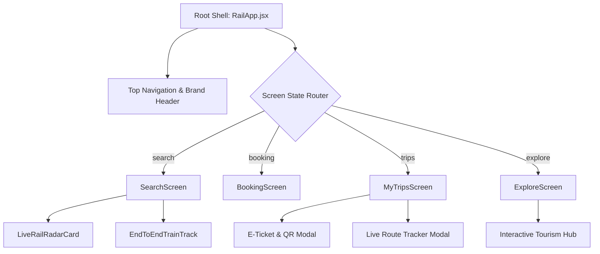

<div align="center">

# 🚆 RailYatra — Next-Gen IRCTC Indian Railways Redesign

<a href="https://Mokshagnatej.github.io/RailYatra-Next-Gen-IRCTC-Indian-Railways-Redesign/" target="_blank">
  <!-- Evolution of Indian Railways Section -->
  <table width="100%" style="border-collapse: separate; border-spacing: 10px;">
    <tr>
      <td colspan="3" align="center">
        <h3 style="margin-top: 0; color: #0F2A45;">🚂 The Evolution of Indian Railways</h3>
      </td>
    </tr>
    <tr>
      <td width="33%" align="center" valign="top">
        
        <br><b>The Legacy</b><br><sub style="color: #6D7681;">Classic WDP4D Diesel Power</sub>
      </td>
      <td width="33%" align="center" valign="top">
        
        <br><b>The Transition</b><br><sub style="color: #6D7681;">High-Capacity Double Decker</sub>
      </td>
      <td width="33%" align="center" valign="top">
        
        <br><b>The Future</b><br><sub style="color: #6D7681;">Vande Bharat Express</sub>
      </td>
    </tr>
  </table>
</a>

### *Book Indian train tickets without the guesswork. A Premium 3D-inspired Redesign.*

An ambitious, human-centered UI/UX transformation of the Indian Railways Catering & Tourism Corporation (IRCTC) portal. Engineered for speed, clarity, transparency, and delight.

[](https://react.dev/)
[](https://www.typescriptlang.org/)
[](https://vitejs.dev/)
[](https://github.com/pmndrs/zustand)
[](https://lucide.dev/)
[](https://vite-pwa-org.netlify.app/)

**Live Site:** [https://Mokshagnatej.github.io/RailYatra-Next-Gen-IRCTC-Indian-Railways-Redesign/](https://Mokshagnatej.github.io/RailYatra-Next-Gen-IRCTC-Indian-Railways-Redesign/)

</div>

---

## 🌟 What is RailYatra?

Millions of passengers book train tickets across India every day. However, traditional booking portals suffer from high cognitive friction during Tatkal windows, stressful payment dead-ends, and outdated visual aesthetics.

**RailYatra solves this** with an ultra-clean, intuitive, single-page reactive architecture featuring honest seat availability indicators, animated real-time rail radar, instant modal tools, and a frictionless booking engine.

---

## 🚀 Live Demo & Interactive Preview

> **Experience the live build deployed via GitHub Actions!** 
> 
> 👉 [Click here to open the Live App](https://Mokshagnatej.github.io/RailYatra-Next-Gen-IRCTC-Indian-Railways-Redesign/)

<details>
<summary><b>✨ Interactive Walkthrough (Click to Expand)</b></summary>
<br>

1. **Dark Mode Integration**: Toggle your device's system settings to Dark Mode to see the UI automatically shift colors!
2. **Book a Ticket**: Search for a train, select your berth, and try out the OTP checkout flow.
3. **Live Dashboard**: Watch the simulated train radar move in real-time.
4. **PWA Support**: Install it on your phone for offline ticket viewing.
</details>

---

## 🛠️ What I Use & How I Use It (Tech Stack)

### ⚛️ Frontend Framework
- **React 19**: Used for building isolated, highly interactive UI components like the `LiveRailRadarCard`.
- **TypeScript**: Ensures type safety across complex booking payloads and train schedules.

### ⚡ Build Tool & Deployment
- **Vite 8**: Provides lightning-fast HMR during development and bundles our application optimally.
- **gh-pages**: Automates deployment directly to GitHub Pages. Running `npm run deploy` automatically builds the `dist` folder and pushes it to the `gh-pages` branch.

### 📦 State Management
- **Zustand**: A small, fast, scalable bearbones state-management solution.
  - *How I use it:* Manages global states like `useJourneyStore` (tracking the live train progress) and `useBookingStore` (storing ticket data persistently).

### 🎨 Styling & 3D Aesthetics
- **Tailwind CSS V4**: Rapid utility-first styling.
- **CSS Modules & Variables**: Used for the deep dark-mode and custom color mappings (like `--marigold` and `--blue`).
- **Glassmorphism**: Backdrop blur effects are heavily used in modals to give a modern, layered, "floating" 3D aesthetic to the UI.

### 🌐 PWA (Progressive Web App)
- **Vite PWA Plugin**: Automatically generates service workers.
  - *How I use it:* Caches the app shell and user's `MyTripsScreen` so they can access their e-ticket even when the train goes through a tunnel and they lose network connectivity.

---

## 📐 Architecture & Flow



---

## 🎨 Design System & Tokens

The design system honors Indian Railways' heritage while adopting a modern editorial aesthetic:

| Token | CSS Variable | Hex / Value | Purpose |
| :--- | :--- | :--- | :--- |
| **Deep Rail Blue** | `--blue` | `#0F2A45` | Primary navigation, brand surfaces, active buttons |
| **Marigold Yellow** | `--marigold` | `#E5A93D` | Call-to-actions, badges, brand accents |
| **Heritage Paper** | `--paper` | `#F7F4EC` | Soft textured warm canvas background |
| **Forest Green** | `--green` | `#1F7A4C` | Confirmed seats, on-time alerts, verified KYC |
| **Signal Red** | `--red` | `#C23B32` | Cancellations, errors, Tatkal warnings |

---

## 💻 Getting Started (Local Setup)

<details open>
<summary><b>1. Clone the repository</b></summary>

```bash
git clone https://github.com/Mokshagnatej/RailYatra-Next-Gen-IRCTC-Indian-Railways-Redesign.git
cd RailYatra-Next-Gen-IRCTC-Indian-Railways-Redesign
```
</details>

<details open>
<summary><b>2. Install dependencies</b></summary>

```bash
npm install
```
</details>

<details open>
<summary><b>3. Start the local server</b></summary>

```bash
npm run dev
```
> The application will be live at `http://localhost:5173/`.
</details>

<details open>
<summary><b>4. Deploy to GitHub Pages automatically</b></summary>

If you want to push your latest changes live, simply run:
```bash
npm run deploy
```
> This will automatically build the `dist` folder and push the changes directly to the `gh-pages` branch. In your repository settings, make sure **Settings > Pages > Source** is set to **Deploy from a branch** and select the `gh-pages` branch.
</details>

---

## 👥 Contributors & Credits

- **Design & Engineering**: Redesigned with care for the Indian rail commuter community.
- **Disclaimer**: *This project is an independent UI/UX concept and portfolio demonstration. Not officially affiliated with or endorsed by Indian Railways or IRCTC Ltd.*

<div align="center">
  <sub>Made with ❤️ for Indian Railways travelers.</sub>
</div>
