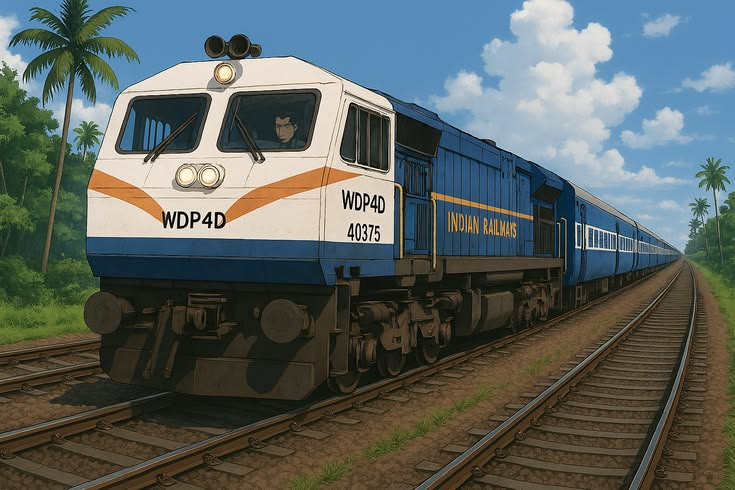
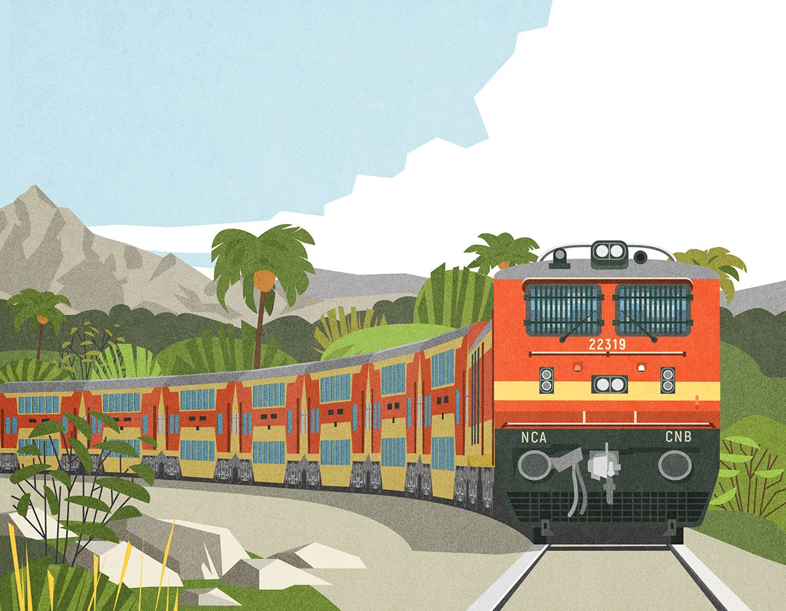
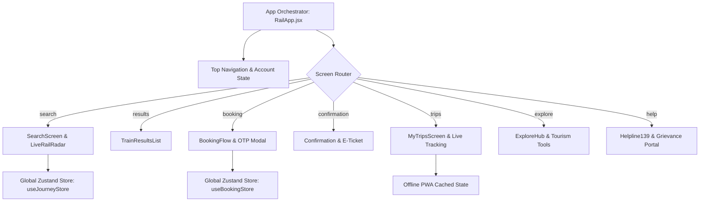

<div align="center">

# 🚆 RailYatra — Next-Gen IRCTC Indian Railways Redesign

<p align="center">
  <b>Book Indian train tickets without the guesswork. A Premium 3D-inspired Redesign.</b>
</p>

[](https://Mokshagnatej.github.io/RailYatra-Next-Gen-IRCTC-Indian-Railways-Redesign/)
[](https://react.dev/)
[](https://www.typescriptlang.org/)
[](https://vitejs.dev/)
[](https://github.com/pmndrs/zustand)
[](https://tailwindcss.com/)
[](https://vite-pwa-org.netlify.app/)

<br/>

**🔗 Live Website URL:** [https://Mokshagnatej.github.io/RailYatra-Next-Gen-IRCTC-Indian-Railways-Redesign/](https://Mokshagnatej.github.io/RailYatra-Next-Gen-IRCTC-Indian-Railways-Redesign/)

</div>

---

## 🚂 The Evolution of Indian Railways

> *From the iconic roar of diesel workhorses to the silent, aerodynamic acceleration of modern Vande Bharat trainsets — RailYatra is designed to reflect the technological and aesthetic leap of Indian Railways.*

<table>
  <thead>
    <tr>
      <th width="33%" align="center">📜 1. The Legacy</th>
      <th width="33%" align="center">⚡ 2. The Transition</th>
      <th width="33%" align="center">🚄 3. The Future</th>
    </tr>
  </thead>
  <tbody>
    <tr>
      <td align="center" valign="top">
        
        <br/><br/>
        <b>WDP-4D Diesel Power</b>
        <p align="left"><sub>The iconic dual-cab diesel-electric powerhouse that served as the lifeline of express connectivity across India for decades.</sub></p>
      </td>
      <td align="center" valign="top">
        
        <br/><br/>
        <b>High-Capacity Double Decker</b>
        <p align="left"><sub>Bi-level high-density passenger express designed for heavy passenger transit along golden quadrilateral intercity corridors.</sub></p>
      </td>
      <td align="center" valign="top">
        
        <br/><br/>
        <b>Semi-High Speed Vande Bharat</b>
        <p align="left"><sub>State-of-the-art indigenous trainsets with 160 km/h cruising, regenerative braking, automatic doors, and modern ergonomics.</sub></p>
      </td>
    </tr>
  </tbody>
</table>

---

## 🌟 What is RailYatra?

Millions of passengers book train tickets across India every day. However, traditional booking portals suffer from high cognitive friction during Tatkal windows, stressful payment dead-ends, fragmented post-booking tools, and outdated visual aesthetics.

**RailYatra solves this** with an ultra-clean, intuitive, reactive single-page architecture featuring:
- 🎯 **Honest seat availability indicators & RAC predictions**
- 📡 **Animated real-time rail radar & GPS tracking**
- ⚡ **Zero dead-end checkout with OTP simulation**
- 🍱 **e-Catering food ordering integrated directly into your live trip**
- 🌓 **Automatic Dark Mode matching system preferences**
- 📱 **PWA Offline Support for viewing e-tickets in tunnels or offline zones**

---

## 🚀 Live Demo & Interactive Features

> **Try the deployed application right in your browser!** 
> 
> 👉 [Open RailYatra Live App](https://Mokshagnatej.github.io/RailYatra-Next-Gen-IRCTC-Indian-Railways-Redesign/)

<details>
<summary><b>✨ Interactive Walkthrough & Highlights (Click to Expand)</b></summary>
<br/>

1. **System Dark Mode**: Toggle your OS/device appearance to Dark Mode and watch RailYatra seamlessly transition its palette with tailored CSS variables.
2. **Instant Search & Booking Flow**: Search between key junctions (NDLS, BCT, HWH, SBC, MAS) with multi-tier quota and berth preferences.
3. **Simulated OTP Checkout**: Step through the realistic payment modal powered by `input-otp` with automatic verification.
4. **Live Journey Dashboard**: Dynamic real-time speed, platform info, halt-by-halt tracking, and instant meal ordering at upcoming stations.
5. **My Trips Persistence**: Tickets booked in the app automatically persist in your account and generate downloadable digital e-tickets with QR codes.
</details>

---

## 🛠️ Technology Stack (What I Use & How I Use It)

### ⚛️ Frontend & State
- **React 19**: Reactive component architecture for modals, dashboards, and search filters.
- **TypeScript 5.7**: Strict type definitions for train timetables, passenger records, and booking states.
- **Zustand 5.0**: Lightweight global state management for:
  - `useBookingStore`: Persisting passenger details, seat allocations, and route info.
  - `useJourneyStore`: Driving live radar telemetry and train progress.
  - `useAuthStore`: Managing user credentials and booking history.

### 🎨 Styling, 3D Aesthetics & UI
- **Tailwind CSS v4**: High-velocity utility classes with unified CSS color tokens.
- **CSS Custom Properties**: Dynamic theme switching (`--blue`, `--marigold`, `--paper`, `--surface`, `--ink`).
- **Lucide Icons**: Crisp SVG icons for intuitive railway wayfinding and status alerts.
- **Glassmorphism & Micro-animations**: Layered blur backdrops for realistic floating modals and 3D depth.

### 🌐 PWA & Offline Readiness
- **Vite PWA Plugin (`vite-plugin-pwa`)**: Automated Service Worker caching with `CacheFirst` strategy for assets and travel records, ensuring ticket access without cellular reception.

### ⚡ Build & Automated Deployment
- **Vite 8**: Ultra-fast bundler with Hot Module Replacement (HMR).
- **gh-pages**: Automated one-command deployment pipeline (`npm run deploy`).

---

## 📐 Application Architecture



---

## 🎨 Design System & Color Tokens

The visual language balances the heritage of Indian Railways with a refined modern editorial look:

| Token | CSS Variable | Hex Code | Usage |
| :--- | :--- | :--- | :--- |
| **Deep Rail Blue** | `--blue` | `#0F2A45` | Brand identity, navigation headers, primary buttons |
| **Marigold Yellow** | `--marigold` | `#E5A93D` | High-priority CTAs, active highlights, badges |
| **Heritage Canvas** | `--paper` | `#F7F4EC` | Warm paper background for low eye fatigue |
| **Surface Card** | `--surface` | `#FFFFFF` / `#162436` | High-contrast card surfaces with dark mode mapping |
| **Signal Green** | `--green` | `#1F7A4C` | Confirmed berths, on-time telemetry, KYC verified |
| **Alert Red** | `--red` | `#C23B32` | Tatkal countdown urgency, cancellations, TDR |

---

## 💻 Getting Started (Local Setup)

<details open>
<summary><b>1. Clone the repository</b></summary>

```bash
git clone https://github.com/Mokshagnatej/RailYatra-Next-Gen-IRCTC-Indian-Railways-Redesign.git
cd RailYatra-Next-Gen-IRCTC-Indian-Railways-Redesign
```
</details>

<details open>
<summary><b>2. Install dependencies</b></summary>

```bash
npm install
```
</details>

<details open>
<summary><b>3. Start development server</b></summary>

```bash
npm run dev
```
> Open [http://localhost:5173/](http://localhost:5173/) to view the app locally.
</details>

<details open>
<summary><b>4. Deploy changes live to GitHub Pages</b></summary>

```bash
npm run deploy
```
> Automatically builds the project and updates the `gh-pages` branch.
</details>

---

## 👥 Credits & Disclaimer

- **Design & Engineering**: Crafted for the Indian Railways commuter community.
- **Disclaimer**: *This project is an independent UI/UX concept and portfolio redesign. It is not officially affiliated with or endorsed by Indian Railways or IRCTC Ltd.*

<div align="center">
  <sub>Made with ❤️ for Indian Railways travelers across the nation.</sub>
</div>
